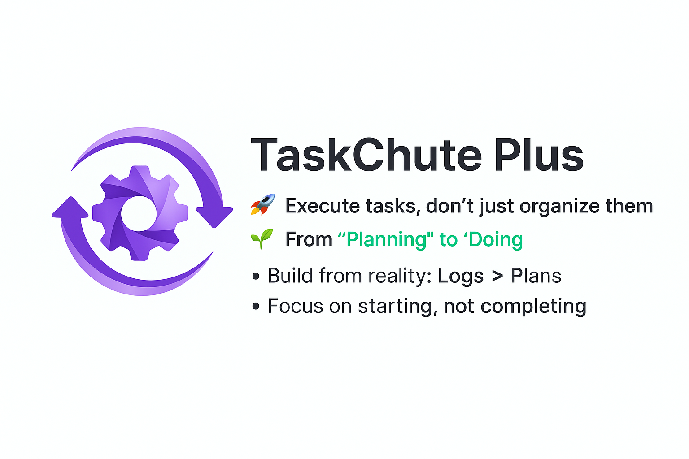

# TaskChute Plus

**Execute tasks, don't just organize them - The path emerges where you walk**

TaskChute Plus brings the revolutionary TaskChute methodology to Obsidian, transforming your task management from endless planning to continuous execution.

## 🌟 The TaskChute Philosophy

Traditional task management is like a map - it shows you where to go but leaves you to figure out how. TaskChute is like GPS navigation - it tells you "turn right at the next corner" and guides you through actual execution.

### The Core Difference

| Aspect | Todo List | TaskChute |
|--------|-----------|-----------|
| **Where to focus?** | Future (Goals) | Present |
| **Planning approach** | Plan backwards from goals | Build forward from reality |
| **Task organization** | By priority | By execution order |
| **What matters in tasks?** | Completing them | Starting them |
| **When tasks end** | They disappear | They remain as logs |
| **When stuck** | Revise the plan | Refer to the record |

## ✨ Key Features

### 🎯 **Execution-Focused Task Management**
- **Automatic task detection**: Identifies notes with `#task` tag automatically
- **Real-time status tracking**: Pending (⏸), Running (▶️), Completed (☑️)
- **1-minute rule**: Start any task for just 1 minute to achieve zero procrastination
- **Log-based routines**: Build routines from actual execution patterns, not wishful thinking

### ⏰ **Time-Based Organization**
- **Time slot management**: Organize tasks by when you'll do them (Morning/Afternoon/Evening/Night)
- **Dynamic task flow**: Automatic idle task migration to current time slots
- **Actual vs Estimated**: Track real time spent to improve future estimates
- **Daily constraints**: Focus on today only - tomorrow's plan is tomorrow's problem

### 📊 **Visual Progress & Reflection**
- **Daily Review**: Focus/fatigue graphs with task comments
- **Procrastination Heatmap**: GitHub-style visualization of task procrastination
- **Project Progress**: Monitor project advancement with time-based calculations
- **Celebration Effects**: Fireworks and confetti when all tasks are completed 🎉

### 🔄 **Smart Routine Management**
- **Flexible scheduling**: Daily, weekly, monthly patterns with specific day selection
- **History preservation**: Maintains execution history even when routine names change
- **Cross-day movement**: Enable temporary rescheduling for routine tasks
- **Pattern-based creation**: Generate routines from successful execution logs

### ⚡ **Frictionless Execution**
- **Quick capture**: Create tasks with simple `#task` tags
- **Hotkey access**: Option+T (Mac) / Alt+T (Win/Linux) for today's tasks
- **Drag & drop**: Intuitive task reorganization with visual indicators
- **Auto-completion**: Smart suggestions from existing task and project names

## 🚀 Getting Started

### Installation
1. Open Obsidian Settings
2. Go to Community Plugins
3. Search for "TaskChute Plus"
4. Install and Enable

### Basic Usage

#### Create Your First Task
1. Create a Markdown file in `TaskChute/Task/` folder
2. Add `#task` tag to the file
3. The task appears in TaskChute view automatically

#### Start Small
- Begin with just 3 tasks for today
- Focus on starting, not completing
- Track actual time, not estimates
- Build routines from successful patterns

#### Execute and Log
1. Open TaskChute view
2. Click ▶️ to start a task
3. Click ⏹ to stop
4. Completed tasks show ☑️
5. All executions are logged automatically

## ⚙️ Configuration

Access plugin settings through: Settings → Community Plugins → TaskChute Plus

### Path Configuration
- **Task folder**: Where task files are stored (default: `TaskChute/Task/`)
- **Project folder**: Project files location (default: `TaskChute/Project/`)
- **Log folder**: Execution history storage (default: `TaskChute/Log/`)

### Display Options
- **Celebration effects**: Enable/disable completion animations
- **Sound effects**: Toggle completion sounds
- **Fireworks/Confetti**: Individual effect controls

### Execution Log Backups
- **Backup interval (hours)**: Minimum time between automatic JSON snapshot backups (`TaskChute/Log/backups/<YYYY-MM>/...`, legacy `.backups` folders are still read). Default is 24 hours; you can shorten or lengthen this depending on how frequently your log changes.
- **Backup retention (days)**: Backups older than this window are deleted automatically during reconciliation (default: 30 days). Lower the value if you want to keep the vault lean.

## ⌨️ Keyboard Shortcuts

### Global
- **Option+T** (Mac) / **Alt+T** (Win/Linux): Show today's tasks

### Task Operations
- **Ctrl+C**: Duplicate selected task
- **Ctrl+D**: Delete selected task (with confirmation)
- **Ctrl+U**: Reset task to pending state

## 📈 Advanced Features

### Daily Review
Requires Dataview and Obsidian Charts plugins for visualization:
- Time-based focus/fatigue tracking
- Comprehensive task comment overview
- Visual progress analysis

### Procrastination Heatmap
GitHub-style contribution graph showing:
- Annual task procrastination patterns
- Special blue animation for zero-procrastination days
- Click navigation to specific dates

## 🛡 Execution Log Resilience

- **Device-aware delta logs**: Every device receives a stable `deviceId` (persisted to the device's local storage, never synced) and writes append-only JSONL delta files under `TaskChute/Log/inbox/<deviceId>/<YYYY-MM>.jsonl` (legacy vaults with `.inbox/` are still read automatically). Old clients can never overwrite the canonical snapshot because they only append.
- **Automatic reconciliation**: The reconciler merges unprocessed delta rows, recomputes daily summaries, writes month-level backups to `TaskChute/Log/backups/<YYYY-MM>/` (respecting the configured backup interval), and bumps `meta.revision` so that each client can detect drift.
- **Records Markdown**: Each mutated day produces `TaskChute/Log/records/<YYYY>/<YYYY-MM-DD>.md` with YAML frontmatter that mirrors the canonical entries (including `entryId`, `deviceId`, and `processedCursor`). Even if JSON snapshots vanish, these record notes remain human-readable backups.
- **Backups housekeeping**: Backups older than the configured retention window are pruned automatically so Sync overhead stays low.
- Year-by-year comparison (2020-present)

### Project Progress Monitoring
- Real-time progress tracking
- Comparison with similar past projects
- Time-based completion estimates
- Visual progress indicators

## 🏗️ Technical Details

### Requirements
- **Obsidian**: v0.12.0 or higher
- **Platform**: Desktop and mobile support

### Data Storage
- **Execution logs**: `TaskChute/Log/YYYY-MM-DD.md`
- **Snapshot backups**: `TaskChute/Log/backups/<YYYY-MM>/<timestamp>.json` (auto-created only when the backup interval elapses; legacy `.backups` folders are still read)
- **Task states**: `.obsidian/plugins/taskchute-plus/data/`
- **Yearly heatmaps**: `TaskChute/Log/heatmap/YYYY/yearly-heatmap.json` (legacy `.heatmap/` + `<year>/yearly-heatmap.json` も読み込み互換)
- **Settings**: Obsidian plugin configuration

## 📚 Documentation

For detailed documentation, visit our [Docusaurus site](taskchute-docs/).

## 🤝 Community & Support

- **GitHub**: [Report issues and contribute](https://github.com/hiroyaiizuka/taskchute-plus)
- **Discussions**: Share your execution stories and tips
- **Documentation**: Comprehensive guides and tutorials

## 📝 License

MIT License

## 👤 Author

Hiroya Iizuka

---

**Remember**: TaskChute Plus doesn't help you organize tasks better - it helps you execute them. It's not about having the perfect plan; it's about taking the next step, logging it, and building from what actually works.

> **"The path emerges where you walk"** - This is the essence of TaskChute.
