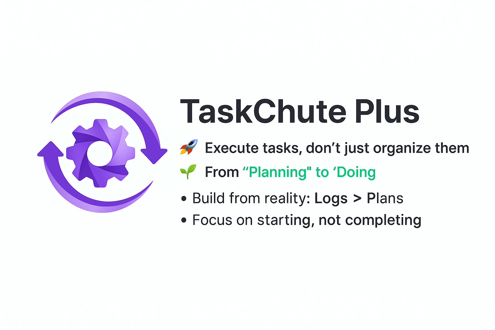

# TaskChute Plus

[English](./README.md) | [日本語](./README.ja.md)

**Execute tasks, don't just organize them.**



TaskChute Plus is an Obsidian plugin focused on execution-first task management:
you decide what to do now, run it, and keep a reliable log of what actually happened.

## What You Can Do

- Manage daily tasks in one TaskChute view with date navigation.
- Start/stop tasks and track actual execution time.
- Group tasks by configurable time slots plus a `No time` section.
- Create and run routines (daily, weekly, monthly patterns).
- Move, duplicate, reset, and delete task instances with day-state persistence.
- Link tasks to projects and open project board views.
- Review history from execution logs and yearly heatmap data.
- Set reminder times per task.
- Export tasks to Google Calendar URL scheme.
- Use Japanese/English UI (or follow Obsidian language).

## Commands

Available from Obsidian Command Palette:

- `Open TaskChute`
- `TaskChute settings`
- `Show today's tasks`
- `Reorganize idle tasks to current slot`
- `Duplicate selected task` (when TaskChute view is active)
- `Delete selected task` (when TaskChute view is active)
- `Reset selected task` (when TaskChute view is active)

## Getting Started

### Install in Obsidian

1. Open `Settings -> Community plugins`.
2. Install/enable `TaskChute Plus`.
3. Run the command `Open TaskChute`.

### First Task

You can create tasks from the TaskChute UI, or manually create a note in your task folder.

Minimal manual example:

```md
---
tags:
  - task
target_date: "2026-04-16"
scheduled_time: "09:00"
---

# Online consultation
```

`#task` in note body is also supported for legacy compatibility.

## Settings Overview

Open `TaskChute settings` to configure:

- Storage location mode (`vaultRoot` or `specifiedFolder`)
- Project folder path (optional, independent path)
- Review template path and filename pattern
- Language override (`auto`, `en`, `ja`)
- Reminder default minutes
- Backup interval/retention for execution snapshots
- Custom time-slot boundaries and collapsible slot UI
- Google Calendar export defaults

Current default values in code:

- `backupIntervalHours: 2`
- `backupRetentionDays: 1`
- `defaultReminderMinutes: 5`
- `locationMode: vaultRoot`

## Default Paths

With default `vaultRoot` mode, TaskChute-managed folders are:

- `TaskChute/Task`
- `TaskChute/Log`
- `TaskChute/Review`

`projectsFolder` is intentionally unset by default and can be configured separately.

## Development

### Requirements

- Node.js 18+
- npm

### Setup

```bash
npm install
```

### Scripts

```bash
npm run dev       # esbuild watch
npm run build     # production bundle
npm run lint      # eslint for src/tests
npm test          # jest
```

### Release Artifacts

Obsidian loads these files from the plugin root:

- `main.js`
- `manifest.json`
- `styles.css`

## License

MIT

## Author

Hiroya Iizuka
