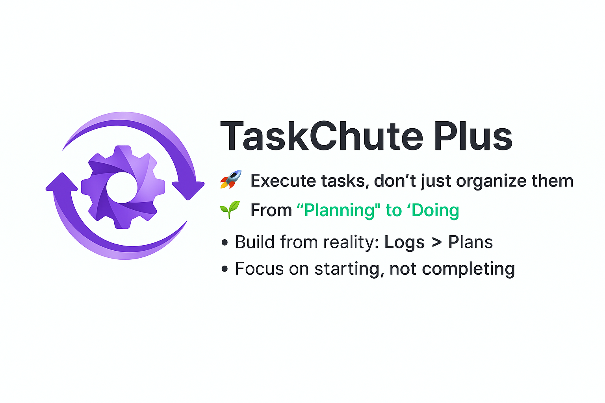

# TaskChute Plus

[English](./README.md) | [日本語](./README.ja.md)

**Execute tasks, don't just organize them.**



TaskChute Plus is an Obsidian plugin focused on execution-first task management:
you decide what to do now, run it, and keep a reliable log of what actually happened.

> [!warning]
> **From version 2.0.0, TaskChute Plus is no longer open-source.** The plugin remains
> free to use. Its source code is maintained in a separate private repository, and only
> the build artifacts (`main.js`, `manifest.json`, `styles.css`) are published here as
> GitHub Releases.
>
> The v1 source code is still open-source under the MIT license:
> [v1 source code](https://github.com/hiroyaiizuka/taskchute-for-obsidian/tree/v1)
> (tag `v1-oss-final`).

> [!note]
> **Your data stays in your vault.** All task, log, review, and heatmap data is stored as
> plain Markdown and JSON inside your own vault. As of today, the plugin has no feature
> that sends this data anywhere.

## What You Can Do

- Manage daily tasks in one TaskChute view with date navigation.
- Start/stop tasks and track actual execution time.
- Group tasks by configurable time slots plus a `No time` section.
- Create and run routines (daily, weekly, monthly patterns).
- Move, duplicate, reset, and delete task instances with day-state persistence.
- Link tasks to projects and open project board views.
- Review history from execution logs and yearly heatmap data.
- Set reminder times per task.
- Export tasks to Google Calendar URL scheme.
- Use Japanese/English UI (or follow Obsidian language).

## Commands

Available from Obsidian Command Palette:

- `Open TaskChute`
- `TaskChute settings`
- `Show today's tasks`
- `Reorganize idle tasks to current slot`
- `Duplicate selected task` (when TaskChute view is active)
- `Delete selected task` (when TaskChute view is active)
- `Reset selected task` (when TaskChute view is active)

## Getting Started

### Install in Obsidian

See [How to Install](#how-to-install) below, then run the command `Open TaskChute`.

### First Task

You can create tasks from the TaskChute UI, or manually create a note in your task folder.

Minimal manual example:

```md
---
tags:
  - task
target_date: "2026-04-16"
scheduled_time: "09:00"
---

# Online consultation
```

`#task` in note body is also supported for legacy compatibility.

## Settings Overview

Open `TaskChute settings` to configure:

- Storage location mode (`vaultRoot` or `specifiedFolder`)
- Project folder path (optional, independent path)
- Review template path and filename pattern
- Language override (`auto`, `en`, `ja`)
- Reminder default minutes
- Backup interval/retention for execution snapshots
- Custom time-slot boundaries and collapsible slot UI
- Google Calendar export defaults

Current default values in code:

- `backupIntervalHours: 2`
- `backupRetentionDays: 1`
- `defaultReminderMinutes: 5`
- `locationMode: vaultRoot`

## Default Paths

With default `vaultRoot` mode, TaskChute-managed folders are:

- `TaskChute/Task`
- `TaskChute/Log`
- `TaskChute/Review`

`projectsFolder` is intentionally unset by default and can be configured separately.

## CHANGELOG

You can read the changelog from [here](./CHANGELOG.md).

## How to Install

| Source | Description |
|---|---|
| [Obsidian Plugin Market](https://obsidian.md/plugins?id=taskchute-plus) | Install from Obsidian's `Settings -> Community plugins`. |
| [GitHub](https://github.com/hiroyaiizuka/taskchute-for-obsidian/releases/latest) | Download the latest release. Put the three files (`main.js`, `manifest.json`, `styles.css`) into `{{obsidian_vault}}/.obsidian/plugins/taskchute-plus/`. |
| BRAT | Add `hiroyaiizuka/taskchute-for-obsidian` to BRAT. |

## Source Code

This repository is distribution-only. The plugin source code is maintained in a
separate private repository, and builds are published here as GitHub Releases.

Obsidian loads these files from the plugin root, and they are attached to every release:

- `main.js`
- `manifest.json`
- `styles.css`

## License

- **Version 2.0.0 and later** — proprietary, see [LICENSE](./LICENSE). Free to use for any
  purpose, personal or commercial. Private modification of your own copy is allowed;
  redistribution is not.
- **Version 1.7.10 and earlier** — MIT License, see the
  [LICENSE on the `v1` branch](https://github.com/hiroyaiizuka/taskchute-for-obsidian/blob/v1/LICENSE)
  (tag `v1-oss-final`).

## Author

Hiroya Iizuka
